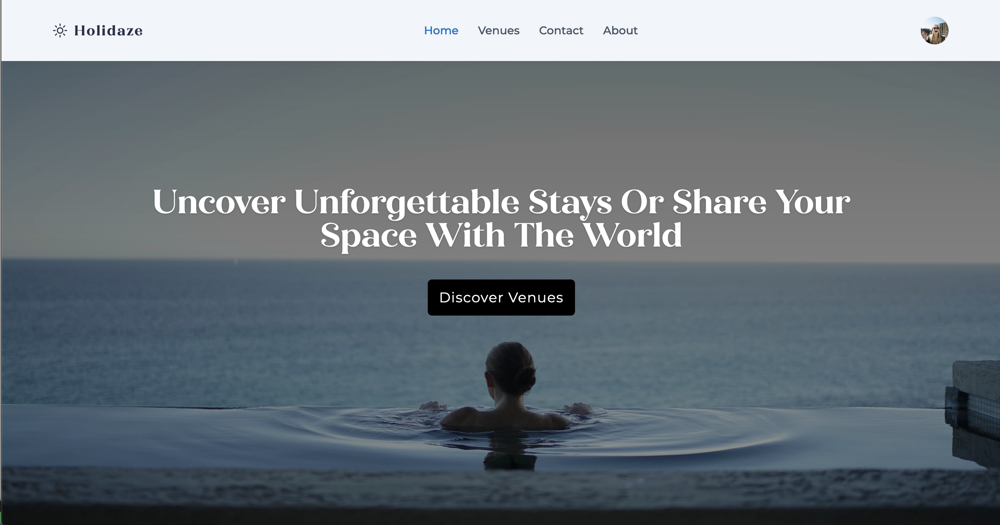

# Holidaze - Project Exam 2023

## Table of Contents

- [Project Overview](#project-overview)
- [Technologies](#built-with)
- [Testing](#testing)
- [Install the project](#getting-started)
- [Contact](#contact)

## Project Overview

Holidaze is the final project for my front-end studies at Noroff. This application represents a complete design and development solution for a fictitious company, Holidaze, offering a platform that serves two distinct user groups - holidaymakers seeking venue bookings, and venue managers seeking a platform to manage venues and bookings. Project management was a part of the assignemtn and is planned using Adobe XD for wireframing and prototyping as well as GitHub projects to set up a kanban board and gantt chart.

User Stories implemented in this project include:

- A user may view a list of Venues
- A user may search for a specific Venue
- A user may view a specific Venue page by id
- A user may view a calendar with available dates for a Venue
- A user with a stud.noroff.no email may register as a customer
- A registered customer may create a booking at a Venue
- A registered customer may view their upcoming bookings
- A user with a stud.noroff.no email may register as a Venue manager
- A registered Venue manager may create a Venue
- A registered Venue manager may update a Venue they manage
- A registered Venue manager may delete a Venue they manage
- A registered Venue manager may view bookings for a Venue they manage
- A registered user may login
- A registered user may update their avatar
- A registered user may logout

This project makes use of the Holidaze API as documented in the Noroff API documentation.

## Built with

- [Vite](https://vitejs.dev/)
- [React](https://react.dev/)
- [Tailwind CSS](https://tailwindcss.com/)
- JavaScript ES6+
- HTML5
- CSS3
- [Noroff Holidaze API](https://noroff-api-docs.netlify.app/holidaze/authentication)

### Testing

This project also includes a few testing suites:

- [Cypress](https://www.cypress.io/): For end-to-end testing to simulate real user interactions.
- [Jest](https://jestjs.io/): For unit testing to validate individual functions and components.

### Planning

- Adobe XD - design wireframes and prototype
- Github Projects - Kanban and Gantt chart

## Getting started

To run this project locally, follow these steps:

1.  Clone the repository to your local machine.
2.  Install dependencies with the command:

        npm install

3.  Start the development server with:

        npm run dev

The application should now be running at localhost:5000 (or your configured local port).

## Contact

- [Email](mailto:maytoveh@gmail.com)
- [Linkedin](https://www.linkedin.com/in/may-tove-hovdal-24b406153/)
